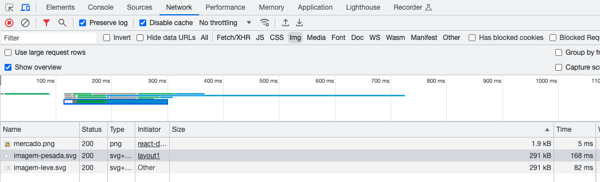
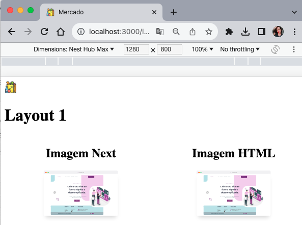

# Proof of Concept (PoC) - Indexação e carregamento de Imagens

Esta é uma prova de conceito simples que demonstra como criar várias páginas no Next.js e gerenciar metadados (como título, descrição e ícone) para cada página, a gerenciar os dados compartilhados através de whatsapp com open graph.
E também como usar o Next.js para otimizar o carregamento de imagens em uma aplicação web. A PoC inclui uma comparação entre o carregamento de imagens diretamente do HTML e o carregamento de imagens usando o componente Next.js Image Optimization.

## Estrutura de Pastas

-   `pages/`: Contém as páginas da aplicação, incluindo a página inicial e as páginas de layout.
-   `public/`: Armazena arquivos estáticos, como ícones.
-   `components/`: Contém os componentes reutilizáveis, como o Layout e NextImage
-   `metadata.json`: Um arquivo JSON que armazena os metadados para cada layout.

## Metadados e Layouts

-   A PoC inclui várias páginas de layout (layout1, layout2, layout3, layout4).
-   Cada página de layout possui seu próprio título, descrição e ícone definidos no arquivo `metadata.json`.
-   O ícone de cada página esta armazenado na pasta `public/`.

### Imagens Não Otimizadas

No HTML padrão, as imagens são carregadas diretamente com a tag ``. No entanto, isso requer otimizações manuais, como dimensionamento, carregamento preguiçoso e otimização de formato.

### Otimização de Imagens com o Componente Image do Next.js

O Next.js fornece o componente `Image`, que lida com essas otimizações automaticamente. Ele oferece as seguintes vantagens:

-   Redimensionamento automático das imagens com base nas necessidades.
-   Carregamento lazy-loading das imagens, economizando largura de banda e acelerando o carregamento da página.
-   Otimização automática do formato da imagem com base no suporte do navegador.

### Comparação de Desempenho

Imagem carregada diretamente do HTML:
Tempo de carregamento: 168ms

Imagem carregada usando o componente Image do Next.js:
Tempo de carregamento: 82ms

### Tecnologias Usadas

-   Next.js
-   React
-   HTML/CSS

### Como Rodar

1. Certifique-se de ter o Node.js instalado em seu sistema.
2. Clone este repositório para sua máquina local usando `git clone`.
3. Navegue até o diretório do projeto usando `cd`.
4. Instale as dependências com `npm install`.
5. Inicie o servidor de desenvolvimento com `npm run dev`.
6. Abra seu navegador e acesse `http://localhost:3000` para ver a PoC em funcionamento.

#

Andressa da Costa
