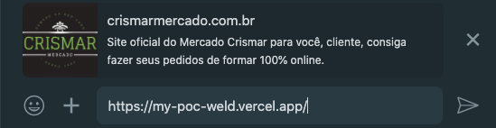
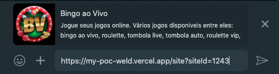
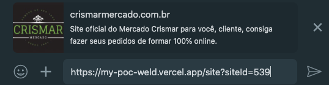

# PoC de Teste para Resolver Problemas de Indexação e Compartilhamento no WhatsApp

✅ - Indexação Correta

✅ - Compartilhamento Correto

✅ - Botão automático Baixar App

⏳ - Problemas de cache ao atualizar versão

❌ - Websocket

#

Prova de conceito (PoC) que aborda a resolução de problemas de indexação e compartilhamento no WhatsApp usando Next.js. Configurando metadados e criando páginas dinâmicas para compartilhamento em redes sociais.

### Configuração de Metadados

-   A página do site (app/site/page.tsx) usa metadados para controlar como as informações são exibidas quando compartilhadas em redes sociais. O objeto metadata é usado para definir o título e a descrição da página, bem como ícones e imagens para compartilhamento.

### Formulário de Pesquisa

-   A página inicial (app/page.tsx) inclui um formulário de pesquisa onde o usuário pode inserir o ID de um site registrado na API. Quando clicar em "Buscar", é redirecionado para a página de destino correspondente ao site, onde as informações do site são exibidas.

### Página de Destino do Site

-   A página de destino do site (app/site/page.tsx) recebe o ID do site como parâmetro de consulta. Ele faz uma chamada à API para buscar informações do site com base no ID e exibe essas informações na página. Além disso, configura os metadados com base nas informações do site para garantir um compartilhamento apropriado em redes sociais.
     
     
     
     
     

### Lighthouse

### Exemplos de compartilhamento por whatsapp:

#

#

## Baixar App automático (atalho na tela inicial do dispositivo)

Desktop botões de instalação do App

#

Desktop Botão Oculto após instalação

#

  

    Botão Mobile
     
    
  

  

    Botão Instalar Mobile
     
    
  

  

    Botão Oculto Mobile
     
    
  

  

    Botão no Iphone (IOS)
     
    
  

  

    PopUp Iphone (IOS)
     
    
  

  

#

  

    Mobile Vídeo
    <video width="320" height="240" controls>
      <source src="/assets/mobile-video-app.mp4" type="video/mp4">
    </video>
  

  

    Desktop Vídeo
    <video width="320" height="240" controls>
      <source src="/assets/desktop-app-video.mov" type="video/mov">
    </video>
  

 
 
 
 
 
 
 
 
 
 
 
 
 
 
 
 
 
 
 

#

#

#

#

#
